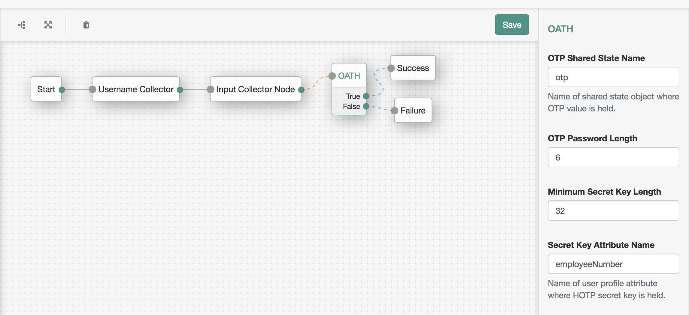

<!--
 * The contents of this file are subject to the terms of the Common Development and
 * Distribution License (the License). You may not use this file except in compliance with the
 * License.
 *
 * You can obtain a copy of the License at legal/CDDLv1.0.txt. See the License for the
 * specific language governing permission and limitations under the License.
 *
 * When distributing Covered Software, include this CDDL Header Notice in each file and include
 * the License file at legal/CDDLv1.0.txt. If applicable, add the following below the CDDL
 * Header, with the fields enclosed by brackets [] replaced by your own identifying
 * information: "Portions copyright [year] [name of copyright owner]".
 *
 * Copyright 2017 ForgeRock AS.
-->
<b>OATH HOTP Authentication Node</b>
 
An authentication node which validates OATH HOTP codes.
 
 
<b>Installation</b>
 
Copy the .jar file from the ../target directory into the ../web-container/webapps/openam/WEB-INF/lib directory where AM is deployed.  Restart the web container to pick up the new node.  The node will then appear in the authentication trees components palette.
 
 
<b>Usage</b>
 
The node should be used in conjunction with a OATH compliant HOTP generator, such as the Google Authenticator, or tokens such as Yubico's Yubikey. Create an authentication tree incorporating this node and a node which prompts the user for the OTP, for example, an Input Collector Node. Configure the Secret Key, HOTP Counter attribute names, and any other HOTP parameters based on your OTP generator device. Also remember to store the Secret Key in the appropriate attribute in the user's profile, and set the counter attribute to 0.
 
The secret key should be stored in an available user profile attribute in base16 (hex) form, for example, the ASCII string "ShhhMySecretKey" converted to base16 is: 53 68 68 68 4D 79 53 65 63 72 65 74 4B 65 79
 
For YubiKey use the YubiKey Personalization Tool and choose OATH-HOTP mode. Copy the hex Secret Key directly to your user profile attribute.
 
For Google Authenticator the same secret key must be encoded in base32. For example, "ShhhMySecretKey" in base32 is "KNUGQ2CNPFJWKY3SMV2EWZLZ". Either manually enter this in the Google Authenticator, or use a QR generator such as http://goqr.me, encode the value "otpauth://hotp/demo?secret=KNUGQ2CNPFJWKY3SMV2EWZLZ" and finally scan this with the Authenticator app (replacing "demo" with your user account).
 
Note: the iOS version of Google Authenticator seems to have problems recognising QR codes where the secret key has been padded with trailing "=" characters (Android version is ok). If the authenticator says "invalid barcode" when scanned, then try choosing a secret key which isn't padded.
 
 
<b>To Build</b>
 
Edit the necessary OATHNode.java if needed.  To rebuild, run "mvn clean install" in the directory containing the pom.xml
 
 
 

 
 
<b>Disclaimer</b>
The sample code described herein is provided on an "as is" basis, without warranty of any kind, to the fullest extent permitted by law. ForgeRock does not warrant or guarantee the individual success developers may have in implementing the sample code on their development platforms or in production configurations.

ForgeRock does not warrant, guarantee or make any representations regarding the use, results of use, accuracy, timeliness or completeness of any data or information relating to the sample code. ForgeRock disclaims all warranties, expressed or implied, and in particular, disclaims all warranties of merchantability, and warranties related to the code, or any service or software related thereto.

ForgeRock shall not be liable for any direct, indirect or consequential damages or costs of any type arising out of any action taken by you or others related to the sample code.